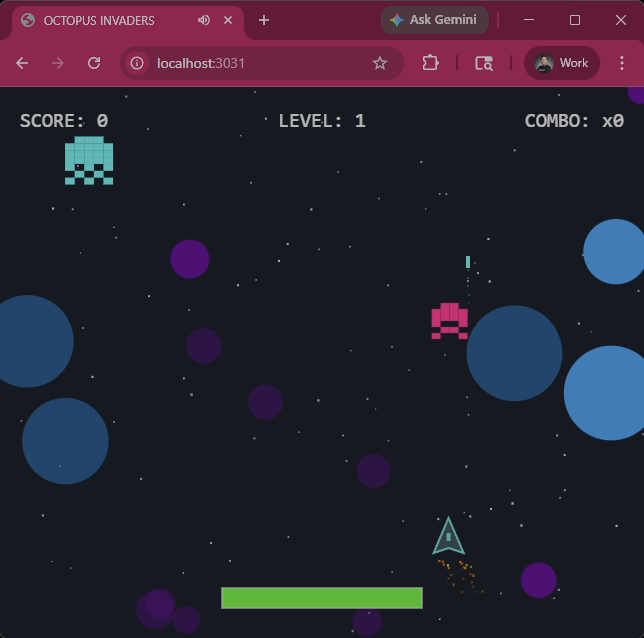

# 🐙 Octopus Invaders

[](demo.mp4)

**Experience the chaos of the deep!** Click the image above to watch a short demo of Octopus Invaders in action.

## 🚀 About the Project
Octopus Invaders is a fast-paced, retro-style space shooter featuring pixel-art octopus aliens, progressive difficulty waves, and an adrenaline-pumping "Unleash" mode.

This project was created by `gemma4-31b-it-awq-8bit` utilizing a mixture of `opencode` and `claude code`, based on a structured octopus invaders prompt provided by **sudoingX**, found at [https://github.com/sudoingX/octopus-invaders/tree/main/prompts](https://github.com/sudoingX/octopus-invaders/tree/main/prompts).

This serves as an anecdotal example of what the model can produce when provided with high-quality, structured input.

## 🛠️ How to Run
Since this is a frontend-only project using ES modules, you need to serve it via a local web server to avoid CORS issues.

1. **Clone the repository:**
   ```bash
   git clone <repository-url>
   cd octopus-invaders/space-shooter
   ```
2. **Start a local server:**
   - Using Python: `python -m http.server`
   - Using Node.js: `npx serve`
   - Or use the "Live Server" extension in VS Code.
3. **Play:** Open your browser to `http://localhost:8000` (or the provided port).

## 🎮 Controls
- **Move:** Mouse
- **Shoot:** Click and Hold
- **Objective:** Survive the waves and collect powerups to activate Unleash mode!